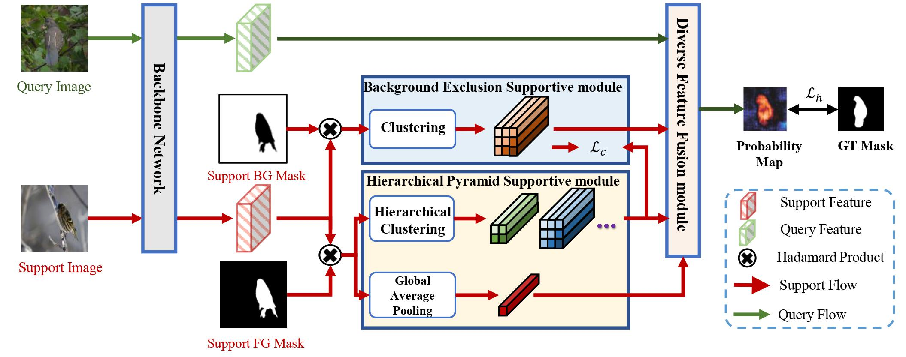

# HCNet
Hierarchical Context-Agnostic Network with Contrastive Feature Diversity for One-Shot Semantic Segmentation



## Usage
### Requirements
python==3.7, torch==1.6, opencv-python, tensorboardX

### Dataset
Prepare related datasets: Pascal-5<sup>i</sup> ([VOC 2012](http://host.robots.ox.ac.uk/pascal/VOC/voc2012/), [SBD](http://home.bharathh.info/pubs/codes/SBD/download.html)) and COCO-20<sup>i</sup> ([COCO 2014](https://cocodataset.org/#download))

### Pre-trained models
- Pre-trained backbones and models can be found in [Google Driver](https://drive.google.com/file/d/1jSgUqtv8lNpggTBCZqvrHjFYk3js3OK1/view?usp=share_link)
- Download backbones and put the pth files under `initmodel/` folder

### Test and  Train
+ Specify the path of datasets and pre-trained models in the data/config file
+ Use the following command 
  ```
  sh tool/test.sh|train.sh {data} {model} {split_backbone}
  ```

  E.g. Test HCNet with ResNet50 on the split 0 of PASCAL-5i:
  ```
  sh tool/test.sh pascal hcnet split0_resnet50
  ```
+ We provide trained Models with the ResNet-50 and VGG-16 backbone on Pascal-5i and COCO-20i for performance evalution. You can download them from [Google Driver](https://drive.google.com/file/d/1CagJKydM-lfJ1PS_whGeQvEWXYep9KRv/view?usp=share_link)

## References
The code is based on [semseg](https://github.com/hszhao/semseg) and [PFENet](https://github.com/Jia-Research-Lab/PFENet). Thanks for their great work!
